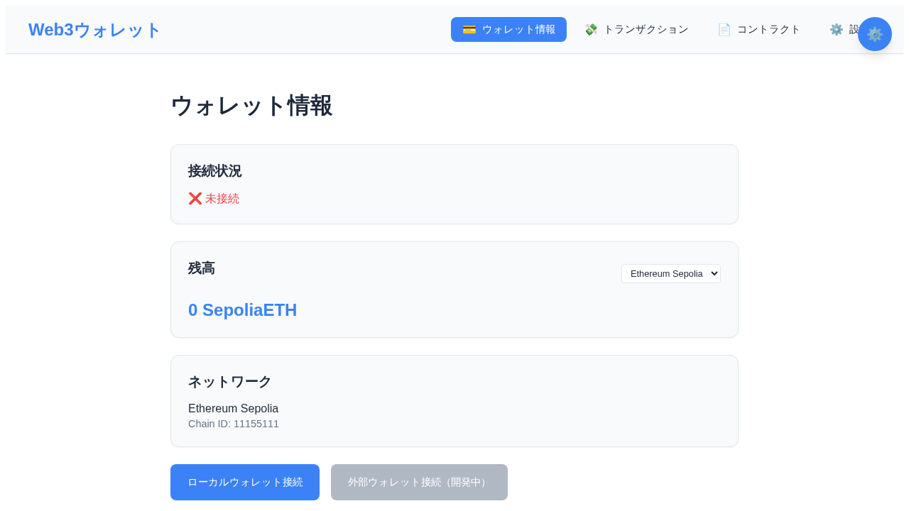

# Web3ウォレットシステム - ユーザーガイド

## 概要

Web3ウォレットシステムは、ブロックチェーン技術を活用したウォレット管理・操作アプリケーションです。
ERC20トークンやERC721 NFTのデプロイ、トランザクション送信、残高確認等の機能を提供します。



## 主な機能

### 1. ウォレット管理
- **ローカルウォレット接続**: .envファイルに設定した秘密鍵によるウォレット接続
- **外部ウォレット接続**: MetaMaskなどの外部ウォレットとの連携（開発中）
- **残高表示**: ETH、ERC20トークンの残高確認
- **ネットワーク切り替え**: Ethereum Sepolia、Polygon Amoyテストネット対応

### 2. コントラクト機能
- **ERC20トークンデプロイ**: カスタムトークンの作成・デプロイ
- **ERC721 NFTデプロイ**: NFTコレクションの作成・デプロイ（開発中）
- **コントラクト検証**: Etherscan/PolygonscanでのS契約コード検証
- **デプロイ履歴管理**: デプロイしたコントラクトの情報保存

### 3. トランザクション機能
- **ネイティブトークン送信**: ETH/POLの送金
- **ERC20トークン送信**: カスタムトークンの送金
- **NFT転送**: ERC721トークンの転送（開発中）
- **ガス料金見積もり**: トランザクション実行前の手数料計算

## セットアップ手順

### 1. 環境構築

#### 必要な環境
- Node.js 18.0.0以上
- npm 8.0.0以上
- Git

#### インストール
```bash
# リポジトリのクローン
git clone <repository-url>
cd web3-wallet-system

# 依存関係のインストール
npm run setup
```

### 2. 環境変数の設定

`.env`ファイルを作成し、以下の項目を設定してください：

```env
# 秘密鍵（テスト用のみ使用、メインネットでは絶対に使用しないでください）
PRIVATE_KEY=your_private_key_here

# RPC エンドポイント
ETHEREUM_RPC_URL=https://sepolia.infura.io/v3/YOUR_PROJECT_ID
POLYGON_RPC_URL=https://amoy.infura.io/v3/YOUR_PROJECT_ID

# デフォルトネットワーク
DEFAULT_NETWORK=sepolia

# Etherscan API キー（コントラクト検証用）
ETHERSCAN_API_KEY=your_etherscan_api_key
POLYGONSCAN_API_KEY=your_polygonscan_api_key

# アプリケーション設定
APP_NAME=Web3ウォレットシステム
APP_VERSION=1.0.0
```

#### 重要な注意事項
- **秘密鍵は絶対にメインネット用を使用しないでください**
- テストネット専用の新しい秘密鍵を生成することを強く推奨します
- `.env`ファイルは`.gitignore`に追加されており、GitHubにコミットされません

### 3. テストネットの設定

#### Sepolia テストネット (Ethereum)
- Chain ID: 11155111
- RPC URL: https://sepolia.infura.io/v3/YOUR_PROJECT_ID
- テストETHの取得: [Sepolia Faucet](https://sepolia.dev/)

#### Amoy テストネット (Polygon)
- Chain ID: 80002
- RPC URL: https://amoy.infura.io/v3/YOUR_PROJECT_ID
- テストMATICの取得: [Polygon Faucet](https://faucet.polygon.technology/)

## アプリケーションの起動

### 開発モード
```bash
# フロントエンド開発サーバー
npm run dev

# バックエンドサーバー
npm run server
```

### 本番モード
```bash
# アプリケーション起動
npm start

# サーバーのみ起動
npm run server
```

### サーバー再起動
```bash
# Linux/Mac
npm run restart:linux

# Windows
npm run restart:windows
```

## 基本的な使用方法

### 1. ウォレット接続

1. アプリケーションにアクセス（通常は http://localhost:3000）
2. 「ローカルウォレット接続」ボタンをクリック
3. .envファイルに設定した秘密鍵のウォレットが自動的に接続されます

### 2. ERC20トークンのデプロイ

1. 「コントラクト」タブに移動
2. 「ERC20トークンデプロイ」セクションで以下を入力：
   - トークン名（例：My First Token）
   - シンボル（例：MFT）
   - 小数点桁数（通常は18）
   - 総供給量（例：1000000）
3. 「ガス見積もり」ボタンで手数料を確認
4. 「デプロイ」ボタンをクリック
5. デプロイ完了後、contracts.jsonにコントラクト情報が保存されます

### 3. トークン送金

1. 「トランザクション」タブに移動
2. 送金タイプを選択（ネイティブ/ERC20）
3. 送金先アドレスと金額を入力
4. ERC20の場合は、デプロイしたコントラクトから選択
5. 「送金」ボタンをクリック

### 4. 残高確認

1. 「ウォレット情報」タブで現在の残高を確認
2. ネットワーク切り替えで異なるチェーンの残高も確認可能

## トラブルシューティング

### よくある問題と解決方法

#### 1. ウォレット接続できない
- `.env`ファイルの`PRIVATE_KEY`が正しく設定されているか確認
- 秘密鍵に`0x`プレフィックスは不要です
- サーバーを再起動してみてください

#### 2. デプロイが失敗する
- 十分なテストETH/MATICがあるか確認
- RPC URLが正しく設定されているか確認
- ネットワークの混雑状況を確認

#### 3. ガス見積もりが失敗する
- RPC接続が正常か確認
- コントラクトのコンパイルが完了しているか確認（`npm run compile`）

#### 4. コントラクト検証が失敗する
- EtherscanまたはPolygonscanのAPI キーが正しく設定されているか確認
- デプロイから時間を置いてから検証を試してみてください

### ログの確認

アプリケーションの動作状況は以下で確認できます：

```bash
# サーバーログをリアルタイムで確認
npm run server

# テストログの確認
npm run test
```

### サポートが必要な場合

- GitHub Issues: プロジェクトリポジトリのIssueタブ
- ドキュメント: README.mdファイル
- 開発者向け情報: .claudeファイル

## セキュリティに関する注意事項

1. **秘密鍵の管理**
   - 本番環境では絶対に秘密鍵をコードに含めない
   - .envファイルは適切なアクセス権限を設定
   - テストネット専用の鍵のみ使用

2. **ネットワーク設定**
   - RPC URLは信頼できるプロバイダーを使用
   - API キーは定期的に再生成

3. **トランザクション**
   - 送金前に宛先アドレスを必ず確認
   - 大きな金額の場合は少額でテスト送金を推奨

## 更新履歴

- v1.8.0: コードリファクタリング、ドキュメント整備
- v1.7.0: オーナーアドレス修正、.env秘密鍵からの自動算出
- v1.6.0: Hardhat Ignition対応、契約検証機能
- v1.5.0: 基本機能実装完了